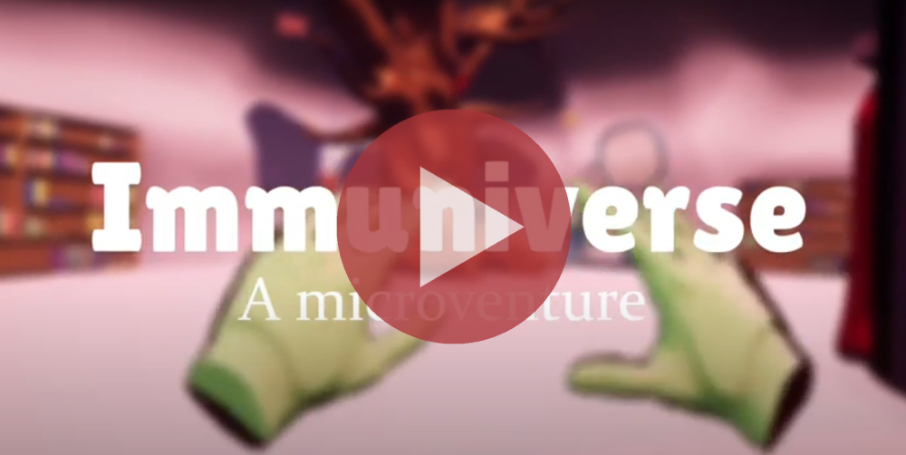
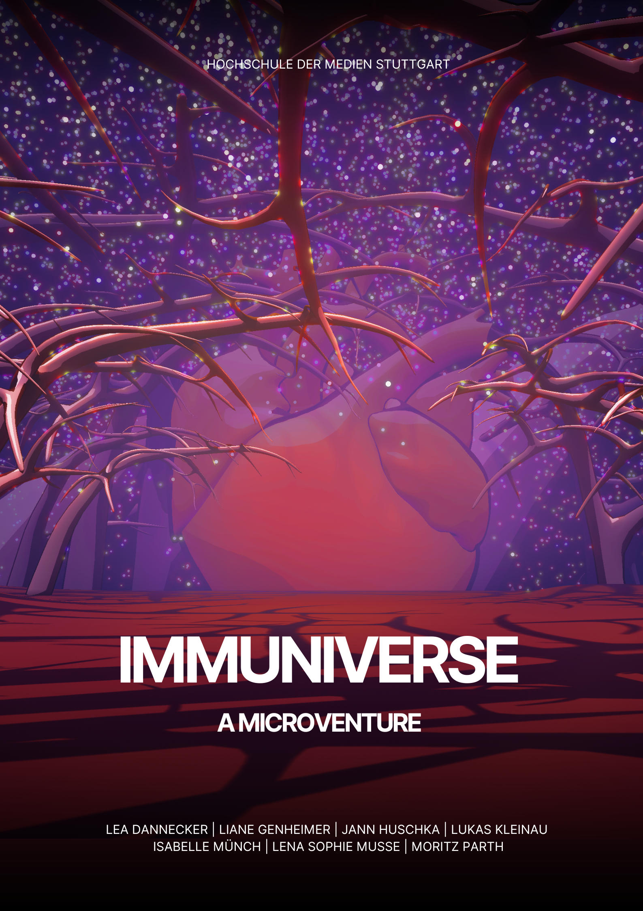
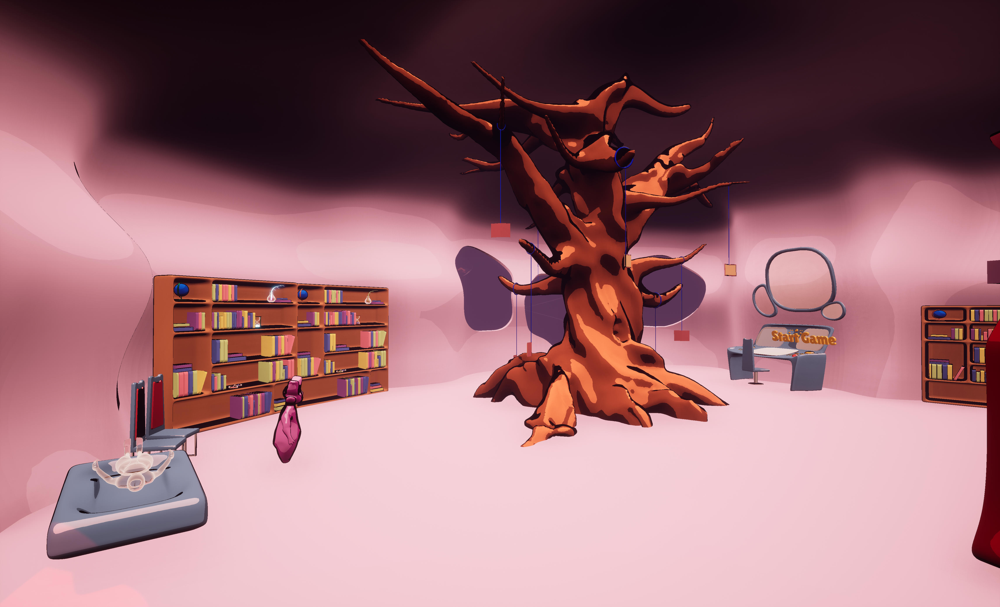
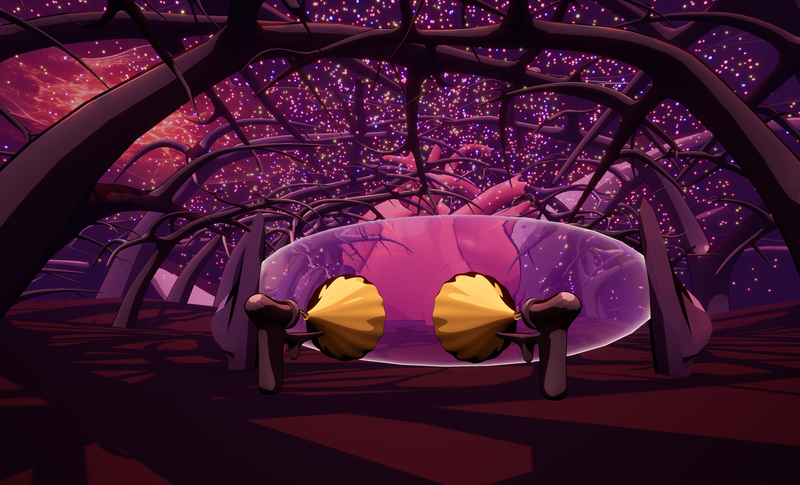
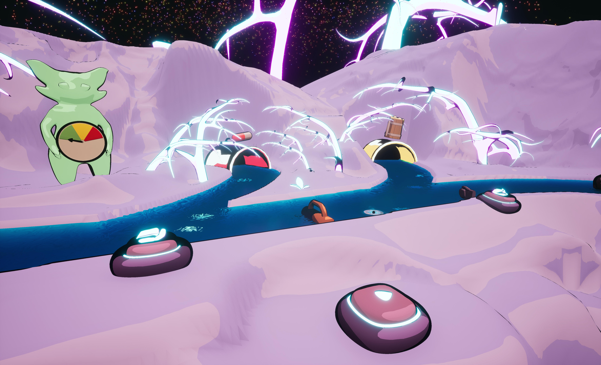

# Immuniverse - VR Game

## Description
The objective of Immuniverse is to keep the body healthy by mastering various minigames. Each minigame presents a specific challenge related to a particular body system or organ. Players are immersed in a virtual environment that mimics the inside of the body and offers a wealth of details and visual effects. Immerse yourself in the immuniverse and become the hero of the human body by mastering various minigames and keeping the body healthy!

## Trailer on Youtube
  

## Download
[download](https://drive.google.com/drive/folders/1NTbjUPP-95CzDiBaMNmlEwosqmpLTpSw?usp=sharing) build for windows

## Insights

